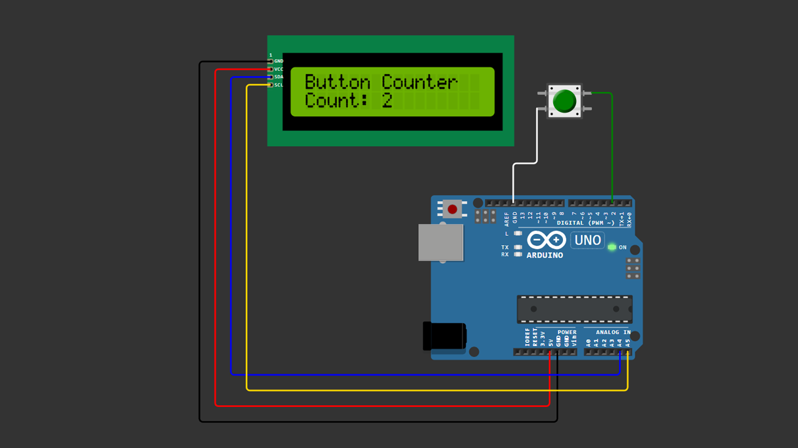

# Arduino LCD I2C Button Counter

A beginner-friendly Arduino project demonstrating how to use a push button to increase a counter value and display it on a **16x2 LCD with an I2C module**.

Each time the button is pressed, the counter increases by **+1**, and the updated value is displayed instantly on the LCD screen.

---

## 📌 Project Overview

Push buttons are one of the most common input devices in electronics projects.

In this project, Arduino reads a button press using the **INPUT_PULLUP** feature and updates a counter value. The counter is then displayed on a **16x2 LCD with an I2C interface**, making the circuit simpler because only two communication wires are needed.

When the button is pressed:

- Button pressed → Counter increases by **+1**  
- LCD display updates with the new value  

This project is great for beginners learning how to combine **digital input and LCD display output** in Arduino.

---

## 🧰 Components Required

- Arduino Uno / Nano  
- LCD 16x2 with I2C module  
- Push Button  
- Jumper Wires  
- Breadboard (optional)

---

## 🔌 Wiring Connections

### LCD I2C → Arduino

| LCD | Arduino |
|-----|---------|
| VCC | 5V |
| GND | GND |
| SDA | A4 |
| SCL | A5 |

### Push Button → Arduino

| Button | Arduino |
|--------|---------|
| One leg | Pin 2 |
| Other leg | GND |

> The button uses Arduino's **internal pull-up resistor (INPUT_PULLUP)**.

---

## 📷 Wiring Diagram

> Make sure your wiring matches the diagram above before uploading the code.

---

## 💻 Arduino Code

You can download the Arduino sketch here:

[Download Arduino Code](arduino-lcd-i2c-button-counter.ino)

Or open the `.ino` file directly inside this repository.

---

## 🚀 Getting Started

1. Connect all components according to the wiring table.  
2. Install the **LiquidCrystal_I2C** library if it is not installed.  
3. Upload the provided Arduino sketch.  
4. Press the button.  
5. Observe the **counter value increasing on the LCD display**.

---

## 🧠 Learning Concepts

This project helps you understand:

- Digital input reading  
- Using **INPUT_PULLUP**  
- Button press detection  
- Counter implementation  
- LCD I2C display basics  
- Arduino user input interaction  

---

## 🔄 Possible Improvements

You can expand this project by adding:

- Button decrement (down counter)  
- Reset button  
- Menu system with multiple buttons  
- Rotary encoder navigation  
- EEPROM save for counter value  

---

## 🎥 Video Tutorial

Watch the full step-by-step tutorial on YouTube:

In this video, you will see:

- Complete wiring demonstration  
- Arduino code explanation  
- Button press testing  
- LCD counter update in real-time  

If this project helps you, consider subscribing for more beginner-friendly Arduino tutorials 🚀

---

## 📄 License

This project is open-source and free to use for educational purposes.

---

Happy Coding 🚀
